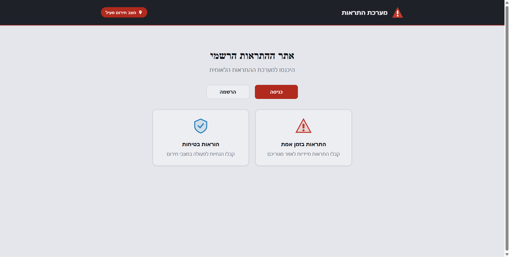
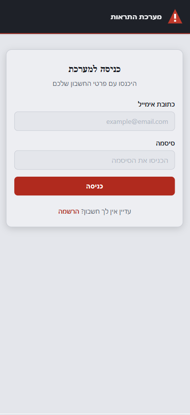
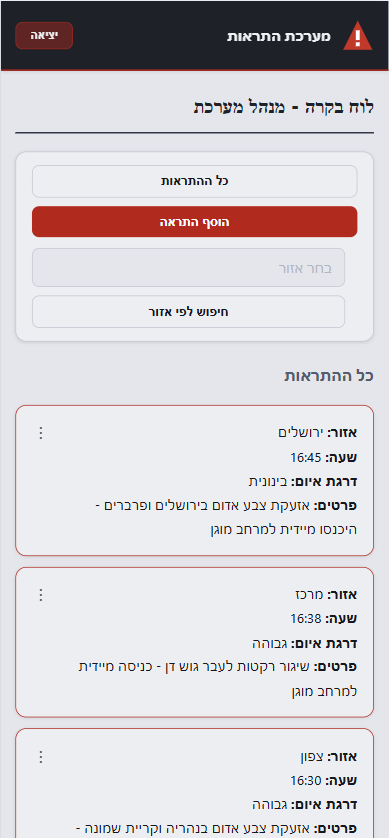

# Alert System - מערכת התראות

## Project Description

Alert System is a JavaScript-based web application that simulates a national alert system. The system allows users to receive real-time alerts based on their area of residence, and administrators to manage and add new alerts.

The project includes:
- Hebrew user interface with custom design
- Authentication system with different roles (regular user and administrator)
- localStorage-based database
- Alert display by area and emergency level

## Key Features

- **Real-time Alerts**: Receive immediate alerts for your area of residence
- **Alert Management**: Administrators can add, edit, and delete alerts
- **Area-based Search**: Filter alerts by geographical area
- **Emergency Levels**: Alerts with different levels (High, Medium, Low, Message)
- **User-friendly Interface**: Custom design with icons and colors

## Installation and Setup

The project is a client-side only application and does not require a server. To run the system:

1. Download or clone the project to your computer
2. Open the `alert-system.html` file in a web browser (Chrome, Firefox, Edge, etc.)

That's it! The system will work directly in the browser.

## Using the System

### First-time Registration

1. Click the "הרשמה" (Register) button on the main page
2. Fill in the details: full name, email, password, area of residence
3. Click "הרשמה" (Register)

### Logging in as Administrator

To log in as an administrator:
1. Click "כניסה" (Login)
2. Enter email: `manager@gmail.com`
3. Enter any password (e.g., `admin123`)
4. Click "כניסה" (Login)

**Note**: If this is the first use, you need to register first with the email `manager@gmail.com`.

As an administrator you can:
- View all alerts in the system
- Add new alerts
- Search alerts by area

### Logging in as Regular User

To log in as a regular user:
1. Register with an email other than `manager@gmail.com`
2. Click "כניסה" (Login) and enter your account details

As a regular user you can:
- View alerts in your area of residence
- View all alerts in the system

## Project Structure

```
alert-system/
├── alert-system.html      # Main application file
├── alert-system.css       # CSS styling
└── JS/
    ├── client.js          # General client logic
    ├── administrator.js   # Administrator logic
    ├── loginSignup.js     # Login and signup handling
    ├── management.js      # General management
    ├── viewAlerts.js      # Alert display
    ├── FXML.js            # XMLHttpRequest simulation
    ├── network.js         # Network handling
    ├── DB/
    │   ├── alertsDB.js    # Alerts database
    │   └── usersDB.js     # Users database
    └── SERVERS/
        ├── alertsServer.js # Alerts server (simulation)
        └── usersServer.js  # Users server (simulation)
```

## Technologies Used

- **HTML5**: Application structure
- **CSS3**: Styling and design
- **Vanilla JavaScript**: Client-side logic
- **localStorage**: Local data storage
- **SVG**: Icons and graphics

## Screenshots

### Homepage


### Login Form


### Admin Dashboard


## LIVE DEMO

You can see the system in action at: [Live Demo](link-to-live-demo)

## Contributing

If you want to contribute to the project:
1. Fork the project
2. Create a new branch for your feature (`git checkout -b feature/AmazingFeature`)
3. Commit your changes (`git commit -m 'Add some AmazingFeature'`)
4. Push to the branch (`git push origin feature/AmazingFeature`)
5. Open a Pull Request

## License

This project is free to use.

## Contact

For questions or suggestions: [Your email or GitHub Issues link]

---

**Note**: This system is a simulation for learning and demonstration purposes. It is not connected to any real alert system.</content>
<parameter name="filePath">c:\Users\ציפי צוקרוב\Documents\fullStuck\PROJECTS\oref\README.md